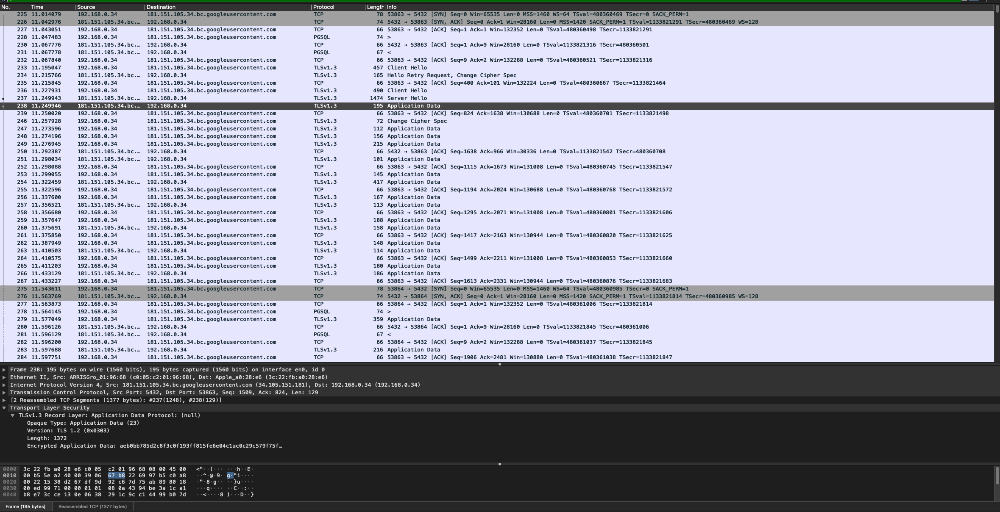

# cloud-sql-tls-test
Testing using TLS 1.2 to encrypt in transit database connection.

This application will connect to a PostgreSQL database and import the top 1000 names in the USA from 2019

# Results, without SSL Enabled:


# Results, with SSL enabled:


# Ensure TLS is enabled and check version
You can ensure TLS is enabled and check which TLS version is being used for active connections with the `PSQL` command `SELECT * FROM pg_stat_ssl;`


# Instructions
Before running tests infra must first be provisioned using terrafrom. Once Cloud SQL has been configured you should connect to the console and run the following SQL:

```sql
CREATE TABLE people  (
    first_name VARCHAR(20) NOT NULL PRIMARY KEY,
    sex VARCHAR(2),
    qty integer
);
```

Then to run the application run the following

```bash
mvn clean package
java -jar target/cloud-sql-demo-0.0.1-SNAPSHOT.jar
```

## Provision Infrastructure

### Create GCP Project
This only needs to be run if you do not have an existing project. You may need to enable billing on the account after it has been created

```bash
export PROJECT_ID=iap-test-9kx82
gcloud projects create $PROJECT_ID
gcloud config set project $PROJECT_ID
gcloud services enable sqladmin.googleapis.com
```

### Create Service account for terraform
You will need a service account and key in order to run terraform commands, follow the steps to create a service account, download its key and update the `GOOGLE_APPLICATION_CREDENTIALS` env var:

```bash
export SERVICE_ACCOUNT_ID=cloudsql-terraform
gcloud iam service-accounts create $SERVICE_ACCOUNT_ID --display-name="CloudSQL Terraform"
gcloud projects add-iam-policy-binding $PROJECT_ID --member="serviceAccount:$SERVICE_ACCOUNT_ID@$PROJECT_ID.iam.gserviceaccount.com" --role="roles/owner"
gcloud iam service-accounts keys create key.json --iam-account "$SERVICE_ACCOUNT_ID@$PROJECT_ID.iam.gserviceaccount.com"
export GOOGLE_APPLICATION_CREDENTIALS=$PWD/key.json
```

### Run terraform
Now that the account has been configured we can run terrafrom to create the cluster:

```bash
terraform init
terraform apply
```

### Update Application.yml
You must generate an application.yml file, this should contain the login details for the new cloudsql instance. The location of this file should be: src/main/resources/application.yml and content should be

```yml
spring:
  batch:
    initialize-schema: always
  datasource:  
    url: "jdbc:postgresql://< your IP address >:5432/?sslkey=cert/client-key.pk8&requireSSL=true&sslrootcert=cert/server-ca.pem&sslcert=cert/client-cert.pem"  
    username: < your username >
    password: < your password >
```

Alternatively you can use the following command line args when running either mvn or java:

**mvn:** 
```bash
mvn clean package -D--spring.datasource.username="< your username >" -D--spring.datasource.password="< your password >" -D--spring.datasource.url="jdbc:postgresql://< your IP address >:5432/?sslkey=cert/client-key.pk8&requireSSL=true&sslrootcert=cert/server-ca.pem&sslcert=cert/client-cert.pem"
```
**java:** 
```bash
java -jar target/cloud-sql-demo-0.0.1-SNAPSHOT.jar --spring.datasource.username="< your username >" --spring.datasource.password="< your password >" --spring.datasource.url="jdbc:postgresql://< your IP address >:5432/?sslkey=cert/client-key.pk8&requireSSL=true&sslrootcert=cert/server-ca.pem&sslcert=cert/client-cert.pem"
```

### Download cert files into cert folder
First generate a new client cert in the GCP console:


Next download the certs into a new `./cert` folder in this directory


Finally update the permissions to `u=rw` and convert the key to a `DER (binary)` format with the following commands

```bash
openssl pkcs8 -topk8 -inform PEM -outform DER -in cert/client-key.pem -out cert/client-key.pk8 -nocrypt
chmod 600 cert/*
```

---

*OpenSource name dataset used in src/main/resources/yob2019.csv downloaded from [here](https://www.ssa.gov/OACT/babynames/limits.html)*